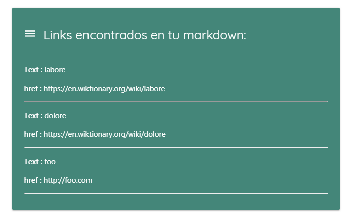
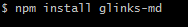
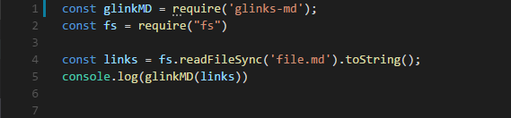

# Glinks MD

Módulo de Node.js que recibe un string (en formato Markdown) y extrae todos los links encontrados en dicho archivo y los devuelve en arreglo de objetos.



## Proyecto desarrollado en [Laboratoria](http://laboratoria.la)

   

## En  [México]

---
Visita el demo en [https://lorevazquez.github.io/extract-links-from-md](https://lorevazquez.github.io/extract-links-from-md)

## Instalación



## Uso

### Ejemplo #1




La implementación debe ser una función, la cual recibe un archivo MD y devuelve un arreglo de objetos con los links encontrados en el archivo como se muestra en el siguiente ejemplo:

```js
const glinksMd = require('glinks-md');
const fs = require("fs");


const links = fs.readFileSync('file.md').toString();

console.log(glinkMD(links))

```

### Ejemplo #2


Se agrega la siguiente línea de código, para que se pueda hacer uso de la función.

```js
<script src="node_modules/glinks-md/lib/extract-link-from-md.js"></script>
```


Ejemplo contenido de archivo MD:

```js
# Lorem ipsum

Lorem ipsum dolor sit amet, consectetur adipiscing elit, sed do eiusmod tempor
incididunt ut [labore](https://en.wiktionary.org/wiki/labore) et
[dolore](https://en.wiktionary.org/wiki/dolore) magna aliqua. Ut enim ad minim
veniam, quis nostrud exercitation ullamco laboris nisi ut aliquip ex ea commodo
consequat.

[foo](http://foo.com)

Duis aute irure dolor in reprehenderit in voluptate velit esse cillum dolore eu
fugiat nulla pariatur. Excepteur sint occaecat cupidatat non proident, sunt in
culpa qui officia deserunt mollit anim id est laborum.;
```

Resultado:

```js
[
  { href: 'https://en.wiktionary.org/wiki/labore', text: 'labore' },
  { href: 'https://en.wiktionary.org/wiki/dolore', text: 'dolore' },
  { href: 'http://foo.com', text: 'foo' },
]
```
---

---
## Desarrolladoras

Ambar de Alejandría & 
Lorena Vázquez
